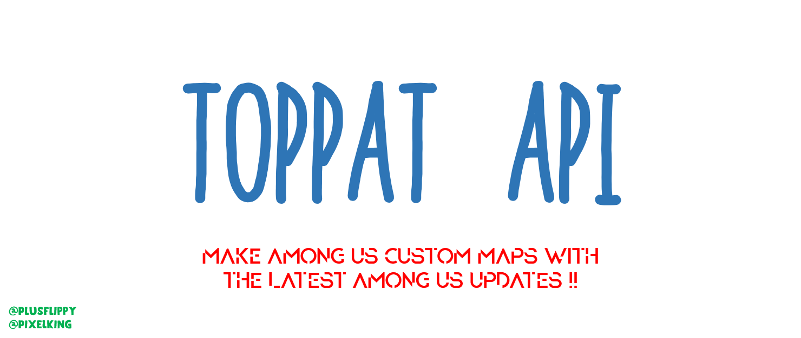

  

## Features
- Includes Latest Among Us map Features (Ladders,Elevators)
 
- Prebuilt Custom Server
 
- Custom Task Support (C# knowledge needed)
 
- Custom Cosmetics
 
And Much More.... (Elevators , Custom Sabotages , Custom Ejects)
# Credits
Owner = PlusFlippy
 
Co-Owner = PixelKing
 
Head Devloper = VoidGo
 
Head Artist = PawanDewmina
 
# Uses:
[Reactor](https://docs.reactor.gg) - framework, will be replaced
 
[LevelIMP](https://levelimposter.net) - API Reference
 
[BepInEx](https://github.com/BepInEx) - For hooking game functions

---------------------------------------------------------------------------------------

This mod is not affiliated with Among Us or Innersloth LLC, and the content contained therein is not endorsed or otherwise sponsored by Innersloth LLC. Portions of the materials contained herein are property of Innersloth LLC.

© Innersloth LLC.

